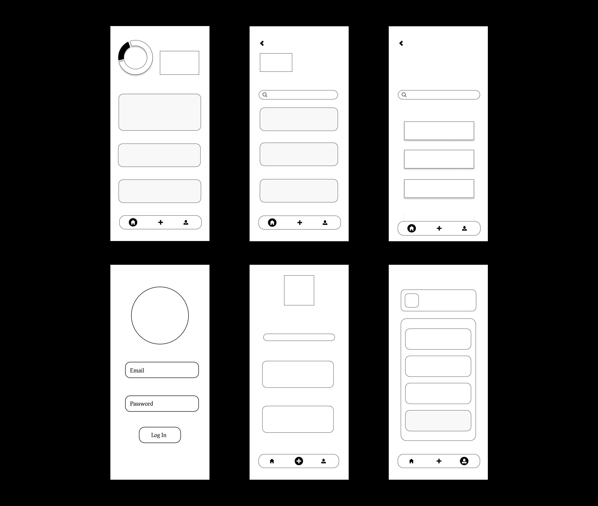

# Project SalvarEgo
Project ini bertujuan untuk membuat aplikasi penyimpanan file Android yang dapat digunakan untuk mengelola file dan dokumen yang dimiiki oleh user. SalvarEgo sendiri berasal dari kata "Salvare" yang berarti penyimpanan dan "Ego" yang berarti saya, maka SalvarEgo dapat diartikan sebagai "Penyimpananku".
 &nbsp;
### !! Software ini masih dalam tahap awal dan belum bisa memenuhi fitur lengkap yang ingin diwujudkan !!
&nbsp;
## MockUp

&nbsp;
## UI/UX

